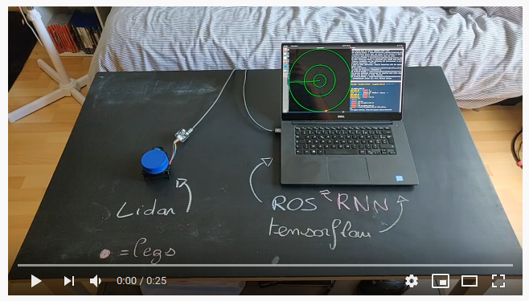
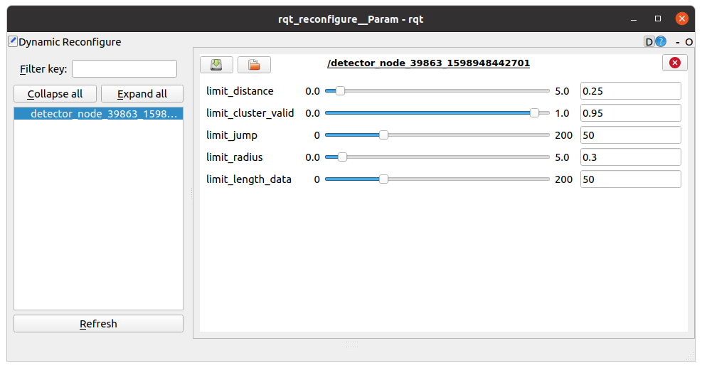
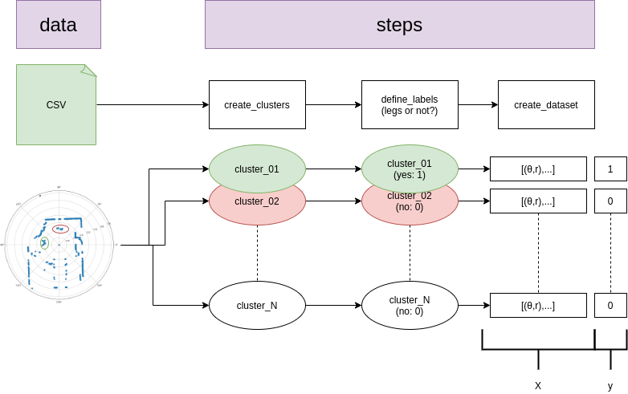
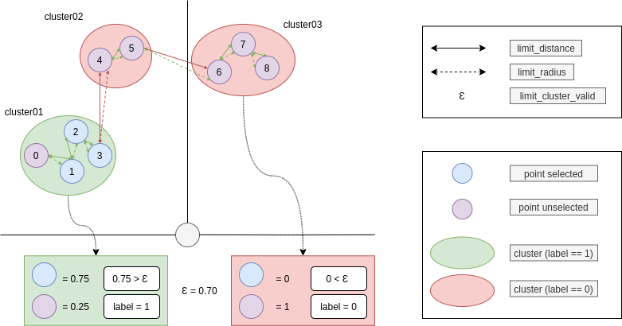
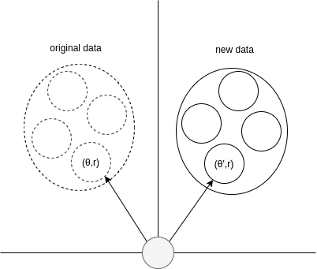
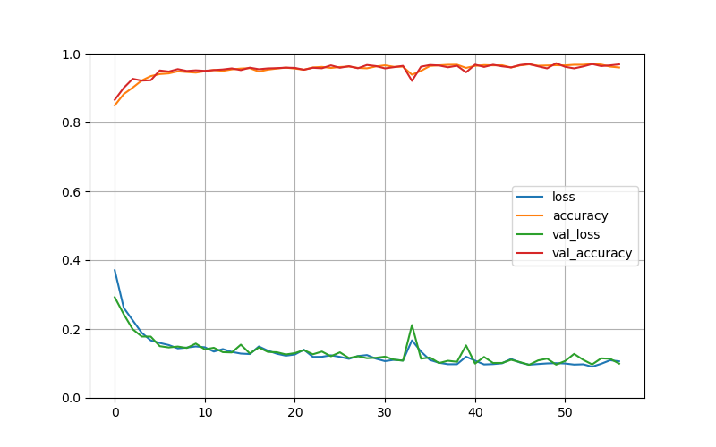
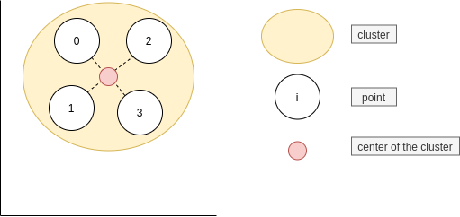

# ros_detection_legs 


- [ros_detection_legs](#ros_detection_legs)
  - [goal](#goal)
  - [use](#use)
    - [deep-learning](#deep-learning)
      - [preprocessing data](#preprocessing-data)
      - [train model](#train-model)
    - [ros](#ros)
      - [compilation packages](#compilation-packages)
      - [run nodes](#run-nodes)
  - [architecture](#architecture)
    - [data extraction](#data-extraction)
    - [data preprocessing](#data-preprocessing)
      - [segmentation](#segmentation)
      - [increase positive data](#increase-positive-data)
    - [training](#training)
      - [information about the current model](#information-about-the-current-model)
    - [prediction](#prediction)

## goal 
Extract legs positions from lidar data, like this: 

[](https://www.youtube.com/watch?v=KcfxU6_UrOo)

https://www.youtube.com/watch?v=KcfxU6_UrOo

## use

### deep-learning

:warning: a model is already trained, saved in **./model/** folder 
:pencil: if you want to change some parameters, please update [./src/ros_detection_legs/deep_learning/config/parameters.json](./src/ros_detection_legs/deep_learning/config/parameters.json)
#### preprocessing data

run preprocessing script:
```
$ python3 src/preprocessing.py
```
once run data are stored in **./data/train/**

#### train model

run training script: 
```
$ python3 src/training.py 
```

### ros

#### compilation packages 

```
# clone 'ros_pygame_radar_2D' to your workspace
$ git clone https://github.com/PouceHeure/ros_pygame_radar_2D

# compile package 
$ catkin build ros_pygame_radar_2D
```

```
# git 'ros_detection_legs' (this pkg) to your workspace
$ git clone https://github.com/PouceHeure/ros_detection_legs

# inside your ros workingspace
$ catkin build ros_detection_legs
```

#### run nodes 

:warning: source devel before


1. run [detector_node](./nodes/detecor_node.py) 
```
$ rosrun ros_detection_legs detector_node.py
```

2. use [ros_pygame_radar2D](https://github.com/PouceHeure/ros_pygame_radar_2D)
```# run radar_node.py 
$ rosrun ros_pygame_radar_2D radar_node.py
```

3. update parameters, some parameters about model are dynamically reconfigurable. By default **dynamic_reconfigure** loads settings save in parameters.json, don't forget to recompile the project if you change parameters.json (because the **dynamic_reconfigure** generates a .h file from the cfg file) !
- compile cfg and generate new configuration file: 
```
# update parameters.json 
$ catkin build 
```
- update parameters dynamically: 
```
$ rosrun rqt_reconfigure rqt_reconfigure
```



## architecture

### data extraction
- package: **ros_lidar_recorder** https://github.com/PouceHeure/ros_lidar_recorder
- data labeling tool: **lidar_tool_label** https://github.com/PouceHeure/lidar_tool_label
- dataset: https://github.com/PouceHeure/dataset_lidar2D_legs


### data preprocessing

This schema defines princpals steps: 



We can create clusters with a segmentation method, by this way data will gathering if there are closed. 

#### segmentation

Before segmentation, we have to found a way how to compute a distance between 2 polar points. 

- First approach, convert all polar points to cartesien and apply a classic norm, but the complexity of this method is too high. 

- Second approach, find a general expression from polar point to cartesian distance. 

<!-- $
distance(p1,p2) = \sqrt{r_1^2*r_2^2 - 2*_1*r_2*cos(\theta_1-\theta_2)}
$ --> 


A second distance is computed: 

<!-- $
distance_{radius}(p1,p2) = abs(r_1 - r_2)
$ --> 


Once expressions are defined, we have to define hyper-parameters:  

- **limit_distance** 
- **limit_radius**

After segmentation, we have to attach a label to each cluster. For this one, we define **limit_cluster_valid**. 

<!-- $
average\_label_{cluster_i} = \frac{card(points_{cluster_i} \text{where point == selected)}}{card(points_{cluster_i})}
$ --> 

<!-- $
label_{cluster_i} =  \left\{
    \begin{array}{ll}
        1 & average\_label_{cluster_i} >= limit\_cluster\_valid \\
        0 & \text{else}
    \end{array}
\right.
$ --> 




#### increase positive data 

We can increase positive data by applying a rotation on these data. 



All positive clusters are selected, on each cluster the same tranformation is applied on each point.   

The transformation is done by this expression: 

<!-- $
\theta' = \theta + \theta_{transformation}
$ --> 
 
So at after transformation, if we have *N* transformations

<!-- $
size_{dataset\_initial} = card(dataset_{initial})
$ --> 

<!-- $
size_{positive\_data} = card(dataset_{initial} \text{where y == 1})
$ --> 

<!-- $
size_{dataset\_final} = size_{dataset\_initial} + N * size_{positive\_data}
$ --> 


### training 

model used: RNN with LSTM cells. 

more information about LSTM: https://www.tensorflow.org/api_docs/python/tf/keras/layers/LSTM


#### information about the current model

settings: [model/train/parameters.json](model/train/parameters.json)

learning curves: 



### prediction

A ros node, **detector_node** subscribes to **/scan** topic. Once data are pusblished to this topic, the node uses the training model to predict legs positions. Legs positions are published to **/radar** topic. 


Like the training, data need to be tranformed. So before prediction, clusters are created directly in the subscriber callback function. 


Define the center point of positive clusters: 



Coordinate of the center of the cluster *j* are:

<!-- $
\theta_{j_{center}} = \frac{1}{card(points_j)}\sum_{i} \theta_{i}
$ --> 

<br/>

<!-- $
r_{j_{center}} = \frac{1}{card(points_j)}\sum_{i} r_{i}
$ --> 